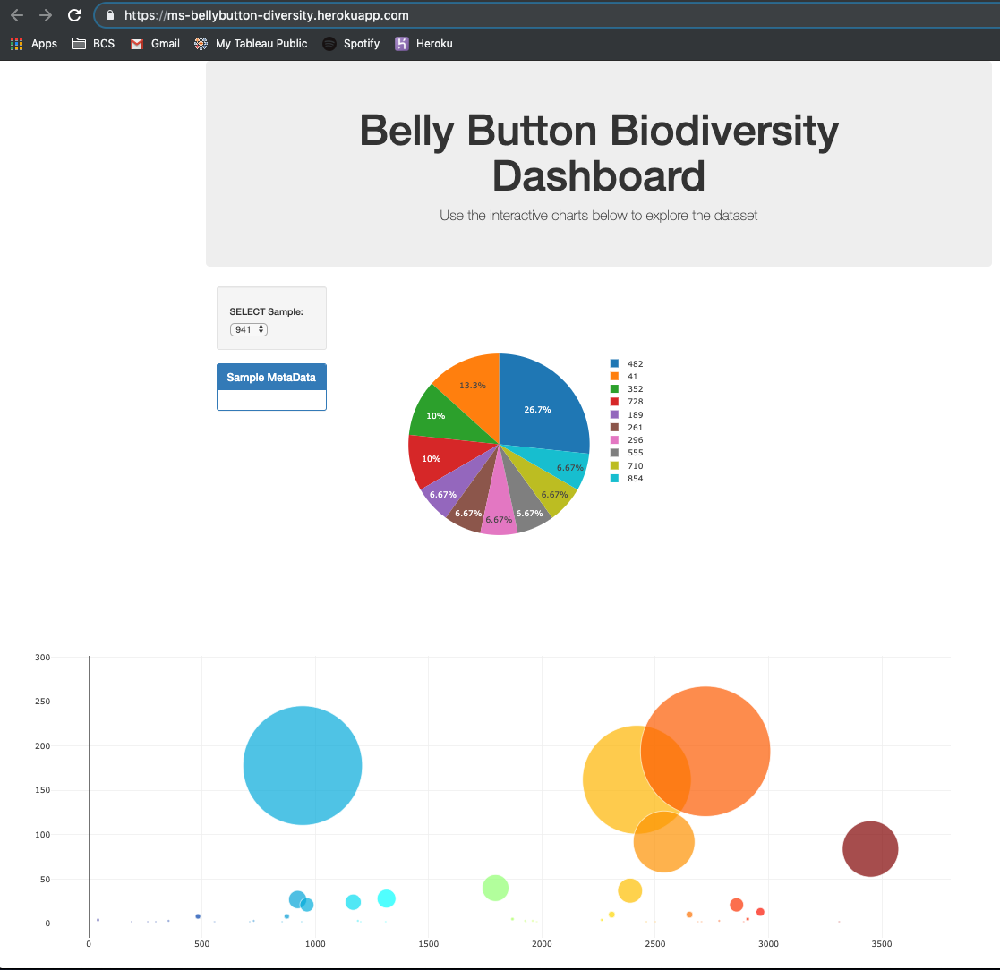

# Deployed on heroku here: 
https://ms-bellybutton-diversity.herokuapp.com/

# Ran into this error for Postgres install
After pip install psycopg2 - error message:
Command "python setup.py egg_info" failed with error code 1 in /private/var/folders/pt/hgx3qlq55015bpw4k8p_zc900000gn/T/pip-install-v8vt08y5/psycopg2/

